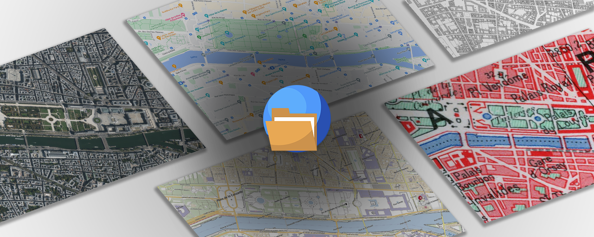

# MapsInMyFolder
MapsInMyFolder is a windows application that allows you to download maps from various online map services, such as Google Maps, Bing Maps, OpenStreetMap, Yandex Maps, and more (in a very high quality).
You no longer need to take a multitude of screenshots and assemble them on your editing software

## Features
- **Map Download**: Access online maps from popular services like Google Maps, Bing Maps, OpenStreetMap, and more.
- **Advanced Customization**: Set detail scale, select geographic area
- **Add Custom Services**: Easily integrate your own online map providers.
- **Intuitive Interface**: A modern and user-friendly interface.
- **Fast Download**: Advanced download features.

MapsInMyFolder is the ideal software for anyone who needs to have large map images (satellite, roads, ...)

## How to use it ?
The complete documentation for this project is available on our [GitHub Wiki](https://github.com/SioGabx/MapsInMyFolder/wiki). This documentation details how to use our software.

## Why am I getting warnings from Windows when installing MapsInMyFolder ?
The MapsInMyFolder files are not digitally signed which results in these kinds of warnings. Signing code is expensive, requires a bunch of paperwork. 
If you do not trust the executable on github, you can install the software from the Windows Store. Alternatively, you can always build the code from source.
